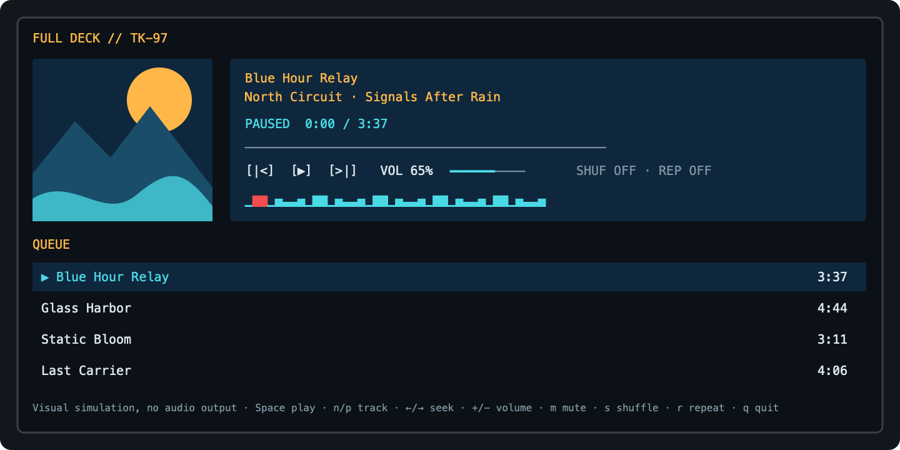

# TermKit

[](https://github.com/binarydreams-io/termkit/actions/workflows/ci.yml)
[](https://github.com/binarydreams-io/termkit/releases)

<a href="https://binarydreams.io" target="_blank" rel="noopener noreferrer">
  
</a>

TermKit is a declarative Swift terminal UI library from <a href="https://binarydreams.io" target="_blank" rel="noopener noreferrer">Binary Dreams, LLC</a>.
It uses a retained view graph, packed terminal cells, damage-limited output, and one shared frame scheduler.

Version `2.2.4` supports Swift 6.3.3, macOS 14 or later, and glibc-based Linux systems.
TermKit requires a UTF-8 terminal.

<br clear="left">
<br>



## Installation

Add TermKit to your package:

```swift
.package(
  url: "https://github.com/binarydreams-io/termkit",
  from: "2.2.4"
)
```

Add the product to your target:

```swift
.product(name: "TermKit", package: "termkit")
```

## Example

```swift
import TermKit

struct CounterView: View {
  @State private var count = 0

  var graphBody: [NodeDescriptor] {
    VStack(alignment: .leading, spacing: 1) {
      Text("Count: \(count)")
      Button("Increment") { count += 1 }
    }
    .padding(1)
    .graphBody
  }
}
```

Pass the root view to `Runtime`. The runtime owns input, signals, reconciliation, layout, paint, presentation, and terminal cleanup.
An idle runtime has no frame deadline.

## TermKitPlayer

Run the adaptive player example:

```bash
swift run --package-path Examples TermKitPlayer
```

TermKitPlayer demonstrates responsive layout, keyboard and pointer input, semantic controls, PNG and JPEG artwork, and scheduled animation.
It is a visual simulation and produces no audio output.

## Architecture

The package publishes one `TermKit` product and one `TermKit` module. Source directories separate these subsystems:

- terminal sessions, input, capabilities, and signals;
- surfaces, damage tracking, cell diffs, and ANSI encoding;
- declarative views, state, environment values, and reconciliation;
- layout, animation, controls, design primitives, and rich text;
- reusable agent interfaces and the runtime;
- bounded PNG and JPEG decoding with terminal image rendering.

Raster images support centered `fit` and `fill`, explicit alpha backgrounds, truecolor, ANSI-256, ANSI-16, and monochrome output.
Network image loading and animated PNG are not part of version 2.2.4.

See [Architecture](Documentation/architecture.md) and [Terminal Compatibility](Documentation/terminal-compatibility.md).

## Verification

Run the root and example tests:

```bash
swift test
swift test --package-path Examples
```

The release tooling lives in `scripts/`. See [Contributing](CONTRIBUTING.md) for the current commands.

## License And Credit

TermKit is available under the [MIT License](LICENSE). Third-party notices are in [NOTICE.md](NOTICE.md).
Public credit with a link to TermKit is appreciated, but this request is voluntary and does not modify the MIT License.

See [Credits](CREDITS.md), [Security](SECURITY.md), [Support](SUPPORT.md), and [Contributing](CONTRIBUTING.md).
